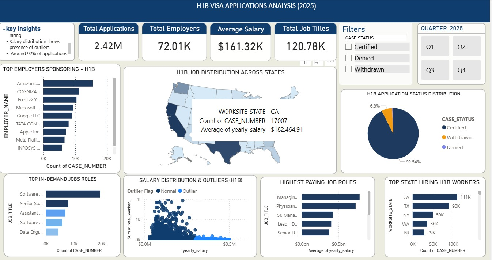

# H1B-Visa-Dashboard
# 📊 H1B Visa Data Analysis Dashboard

##  Overview

This project analyzes H1B visa application data to uncover trends in employer hiring, salary distribution, job roles, and geographical demand.
The objective is to transform raw data into meaningful insights using data cleaning, analysis, and visualization techniques.

---

## 🛠 Tools & Technologies

* **SQL** – Data cleaning and transformation
* **Power BI** – Data visualization and dashboard creation
* **Excel** – Data preprocessing

---

## 📂 Dataset

The dataset contains H1B visa application records with the following fields:

* Employer Name
* Job Title
* Yearly Salary
* Work Location
* Case Status
* case number

---

## Project Workflow

1. Data Collection
2. Data Cleaning using SQL
3. Data Transformation
4. Data Visualization using Power BI
5. Insight Generation

---

## 📈 Key Insights

* Identified top employers sponsoring H1B visas
* Analyzed salary distribution across different job roles
* Observed hiring patterns across locations
* Explored demand trends for different positions
- Most Common Job Roles
- Salary Distribution & outliers (H1B)
- State-wise job opportunities
- Identified top employers sponsoring H1B visas
- Analyzed salary distribution across different job roles
- Observed hiring patterns across locations
- Explored demand trends for different positions
---

## 📊 Dashboard Features

* Salary trend analysis
* Top hiring employers
* Job role distribution
* Location-based analysis
* TOP jobs roles in demand
* Interactive filters and visuals

---

## 📷 Dashboard Preview

---
## 📌 Business Impact
This dashboard provides insights into hiring trends, salary distribution, and job demand, helping stakeholders make informed decisions regarding recruitment strategies and market opportunities.

##  Author

**Anu** – Aspiring Data Analyst
